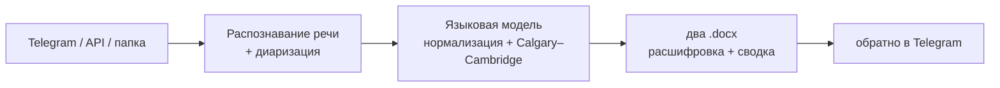
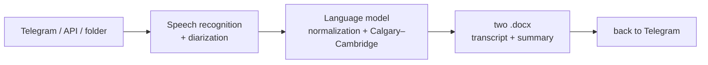

# Медицинский транскрайбер

Аудио приёма у врача → готовый Word-документ: расшифровка по ролям и клиническая сводка.

Русский · [English](#en)

<a name="top"></a>

Превращает аудиозапись приёма у врача в готовый Word-документ. Врач сбрасывает запись — через пару минут получает обратно два файла: дословную расшифровку по ролям и клиническую сводку, разложенную по методике консультации Calgary–Cambridge. Делал, чтобы врачам не приходилось после каждого приёма вручную писать заключение.

Работает в проде в реальной клинике. Здесь — код без ключей, токенов, ФИО врачей и данных пациентов.

[](https://www.python.org)
[](docs/ARCHITECTURE.md)
[](LICENSE)

## Что это

Конвейер на Python. Аудио приходит одним из трёх способов — Telegram-бот, REST-эндпоинт (для десктоп-клиента) или просто папка, за которой следит сервис. Дальше: распознавание речи с разделением спикеров, потом языковая модель чистит и структурирует текст, потом python-docx собирает два `.docx`, и готовое улетает обратно в Telegram.



Подробный разбор — в [docs/ARCHITECTURE.md](docs/ARCHITECTURE.md).

## Что умеет

- Принимает аудио тремя путями: Telegram-бот, FastAPI-эндпоинт, watch-папка.
- Делит речь по спикерам (врач / пациент / ассистент).
- Передаёт в STT словарь медицинских терминов (сотни слов из гинекологии, урологии, репродуктологии, онкологии, лабораторной диагностики) — иначе распознавание калечит узкую лексику.
- Сводку раскладывает по Calgary–Cambridge: пять стадий консультации плюс два сквозных процесса.
- Нормализует термины по справочникам (Cambridge Dictionary of Medicine, ICD-11, MeSH, INN).
- На выходе два документа: расшифровка по ролям и клиническая сводка.
- Не падает, когда кончаются минуты STT — ставит записи в очередь и ждёт пополнения, потом сам продолжает.
- Есть десктоп-клиент на PyQt6 (запись с микрофона прямо у врача).
- В проде гоняется под systemd: автоперезапуск, ротация логов, очистка временных файлов.

## Про промпт

Самое интересное тут — системный промпт ([`server/prompt_full.md`](server/prompt_full.md), ~37 КБ). Это не «перескажи запись», а довольно подробная спецификация извлечения:

- Методика **Calgary–Cambridge** — стандартная модель медицинского интервью; по ней раскладывается сводка.
- Иерархия источников терминологии с явным приоритетом: Cambridge Dictionary of Medicine → ICD-11 → MeSH → INN → клинреки МЗ РФ.
- Cheat-sheet частых ошибок распознавания в медицинской лексике.
- Жёсткое правило: врача определять только по содержанию записи, имён не выдумывать (для медицинского документа это критично).

Реальные ФИО врачей в публичной версии промпта заменены на условные.

## Стек

- Python 3.12
- Распознавание речи — внешний STT-сервис (speech2text) с диаризацией
- LLM — внешняя языковая модель (Messages-style API, прямые HTTP-вызовы на `/v1/messages`, без CLI-обёрток)
- Приём аудио — FastAPI + Uvicorn (Bearer-auth) и Telegram Bot API
- Документы — python-docx
- Доставка — python-telegram-bot + httpx (умеет через прокси)
- Десктоп — PyQt6
- Эксплуатация — systemd (4 юнита + таймер очистки)

## Запуск

```bash
cd server
cp config.example.json config.json     # впиши свои ключи: STT, LLM, токен бота
python -m venv venv && source venv/bin/activate
pip install -r requirements.txt
```

Компоненты запускаются по отдельности:

```bash
python server/transcriber.py                    # конвейер (watch-папка)
uvicorn api:app --host 0.0.0.0 --port 8000      # приёмник для десктоп-клиента (из server/)
python server/bot.py                            # Telegram-бот
```

В проде — через systemd-юниты из [`server/systemd/`](server/systemd/). Секреты при этом берутся из `config.json` (он в `.gitignore`); в юнитах задаются только не-секретные переменные окружения, а ключи в репозитории — заглушки:

```bash
sudo cp server/systemd/* /etc/systemd/system/
sudo systemctl daemon-reload
sudo systemctl enable --now transcriber transcriber-api transcriber-bot transcriber-cleanup.timer
```

## Десктоп-клиент

[`desktop/main.py`](desktop/main.py) — приложение на PyQt6: пишет приём с микрофона и отправляет на сервер с Bearer-ключом, потом забирает готовый документ. Адрес сервера и ключ — в настройках.

```bash
pip install PyQt6 requests
python desktop/main.py
# сборка .exe: pyinstaller desktop/TranscriberClient.spec
```

## Приватность

Проект медицинский, так что в репозитории намеренно нет ничего чувствительного: ключей STT/LLM, токена бота и прокси, ФИО врачей (в промпте они условные), записей и данных пациентов, IP и доменов. Всё это берётся из `config.json` (он в `.gitignore`) — в репозитории лежит только `config.example.json` с заглушками. Временные аудио и документы чистятся по расписанию, чтобы данные пациентов не копились. Детали — в [SECURITY.md](SECURITY.md).

## Структура

```
server/
  transcriber.py        конвейер: audio → STT → LLM → .docx
  api.py                FastAPI-приёмник (Bearer-auth)
  bot.py                Telegram-бот: приём и доставка
  prompt_full.md        системный промпт (Calgary–Cambridge)
  config.example.json   шаблон конфига
  scripts/ · systemd/   запуск, очистка, продакшен-юниты
desktop/                PyQt6-клиент
docs/                   архитектура и диаграммы
```

---

<a name="en"></a>

# Medical Transcriber

Audio of a doctor's consultation → a ready Word document: a role-by-role transcript and a clinical summary.

[Русский](#top) · English

Turns an audio recording of a doctor's appointment into a ready Word document. The doctor uploads a recording — and a couple of minutes later gets back two files: a verbatim transcript split by speaker, and a clinical summary laid out by the Calgary–Cambridge consultation method. Built so doctors don't have to write up a report by hand after every appointment.

Runs in production at a real clinic. What's here is the code without keys, tokens, doctors' names, or patient data.

[](https://www.python.org)
[](docs/ARCHITECTURE.md)
[](LICENSE)

## What it is

A Python pipeline. Audio arrives one of three ways — a Telegram bot, a REST endpoint (for the desktop client), or simply a folder watched by the service. Then: speech recognition with speaker separation, then a language model cleans up and structures the text, then python-docx assembles two `.docx` files, and the result is sent back to Telegram.



For a detailed breakdown, see [docs/ARCHITECTURE.md](docs/ARCHITECTURE.md).

## What it can do

- Accepts audio three ways: Telegram bot, FastAPI endpoint, watch folder.
- Splits speech by speaker (doctor / patient / assistant).
- Feeds the STT a dictionary of medical terms (hundreds of words from gynecology, urology, reproductive medicine, oncology, lab diagnostics) — otherwise recognition mangles the narrow vocabulary.
- Lays the summary out by Calgary–Cambridge: five consultation stages plus two cross-cutting processes.
- Normalizes terms against reference sources (Cambridge Dictionary of Medicine, ICD-11, MeSH, INN).
- Produces two documents on output: a role-by-role transcript and a clinical summary.
- Doesn't crash when STT minutes run out — it queues the recordings and waits for a top-up, then continues on its own.
- Includes a PyQt6 desktop client (microphone recording right at the doctor's desk).
- In production it runs under systemd: auto-restart, log rotation, temp-file cleanup.

## About the prompt

The most interesting part here is the system prompt ([`server/prompt_full.md`](server/prompt_full.md), ~37 KB). It's not "summarize the recording" but a fairly detailed extraction specification:

- The **Calgary–Cambridge** method — the standard medical-interview model; the summary is laid out by it.
- A terminology-source hierarchy with explicit priority: Cambridge Dictionary of Medicine → ICD-11 → MeSH → INN → clinical guidelines of the Russian Ministry of Health.
- A cheat-sheet of common recognition errors in medical vocabulary.
- A hard rule: identify the doctor only from the content of the recording, never invent names (critical for a medical document).

In the public version of the prompt, real doctors' names are replaced with placeholders.

## Stack

- Python 3.12
- Speech recognition — an external STT service (speech2text) with diarization
- LLM — an external language model (Messages-style API, direct HTTP calls to `/v1/messages`, no CLI wrappers)
- Audio intake — FastAPI + Uvicorn (Bearer auth) and the Telegram Bot API
- Documents — python-docx
- Delivery — python-telegram-bot + httpx (can go through a proxy)
- Desktop — PyQt6
- Operations — systemd (4 units + a cleanup timer)

## Running it

```bash
cd server
cp config.example.json config.json     # fill in your keys: STT, LLM, bot token
python -m venv venv && source venv/bin/activate
pip install -r requirements.txt
```

The components are launched separately:

```bash
python server/transcriber.py                    # pipeline (watch folder)
uvicorn api:app --host 0.0.0.0 --port 8000      # intake for the desktop client (from server/)
python server/bot.py                            # Telegram bot
```

In production — via the systemd units from [`server/systemd/`](server/systemd/). Secrets are read from `config.json` (which is in `.gitignore`); the units only set non-secret environment variables, and the keys in the repo are placeholders:

```bash
sudo cp server/systemd/* /etc/systemd/system/
sudo systemctl daemon-reload
sudo systemctl enable --now transcriber transcriber-api transcriber-bot transcriber-cleanup.timer
```

## Desktop client

[`desktop/main.py`](desktop/main.py) — a PyQt6 application: it records the appointment from the microphone and sends it to the server with a Bearer key, then picks up the finished document. The server address and key are set in the settings.

```bash
pip install PyQt6 requests
python desktop/main.py
# build the .exe: pyinstaller desktop/TranscriberClient.spec
```

## Privacy

This is a medical project, so the repository deliberately contains nothing sensitive: no STT/LLM keys, no bot token or proxy, no doctors' names (in the prompt they're placeholders), no recordings or patient data, no IPs or domains. All of that is taken from `config.json` (which is in `.gitignore`) — the repository holds only `config.example.json` with placeholders. Temporary audio and documents are cleaned up on a schedule so that patient data doesn't accumulate. Details are in [SECURITY.md](SECURITY.md).

## Structure

```
server/
  transcriber.py        pipeline: audio → STT → LLM → .docx
  api.py                FastAPI intake (Bearer auth)
  bot.py                Telegram bot: intake and delivery
  prompt_full.md        system prompt (Calgary–Cambridge)
  config.example.json   config template
  scripts/ · systemd/   startup, cleanup, production units
desktop/                PyQt6 client
docs/                   architecture and diagrams
```

---

salim4ek · [MIT](LICENSE)
