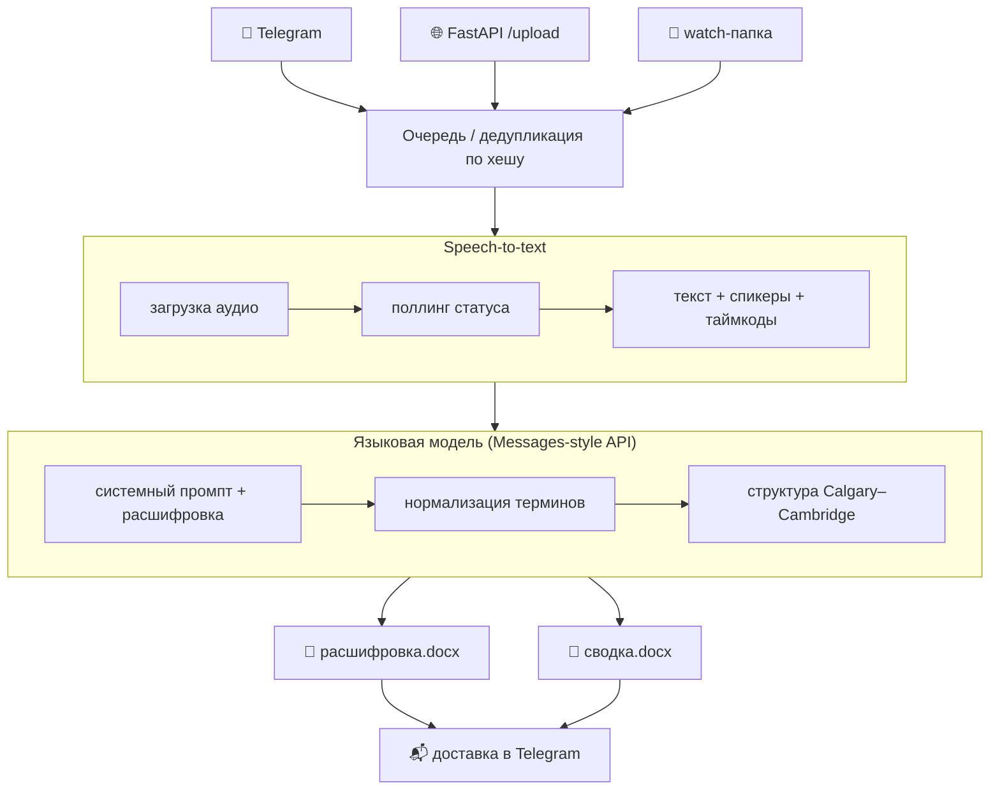
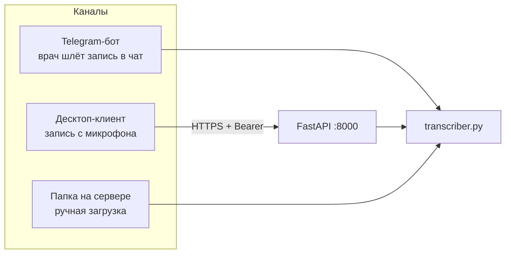
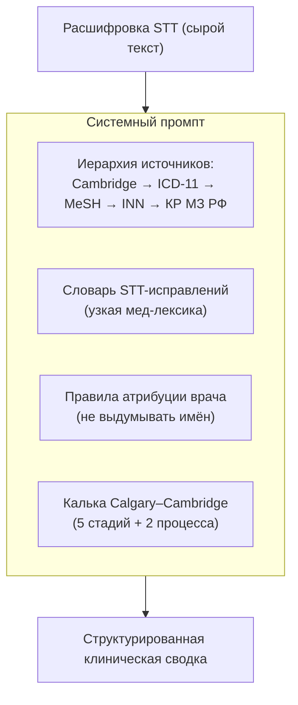
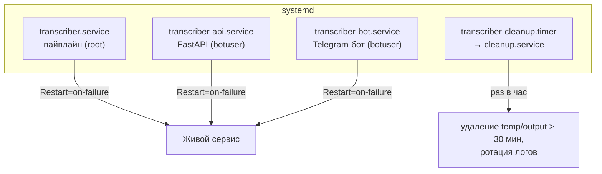

# Архитектура

Технический разбор медицинского транскрайбера: компоненты, конвейер обработки, интеграции и эксплуатация.

---

## Компоненты

| Компонент | Файл | Роль |
|-----------|------|------|
| Пайплайн | `server/transcriber.py` | Ядро: оркестрация STT → LLM → .docx |
| API-приёмник | `server/api.py` | FastAPI-эндпоинт загрузки аудио (Bearer-auth) |
| Telegram-бот | `server/bot.py` | Приём записей и доставка готовых документов |
| Системный промпт | `server/prompt_full.md` | Спецификация извлечения (Calgary–Cambridge) |
| Десктоп-клиент | `desktop/main.py` | Запись с микрофона и отправка на сервер (PyQt6) |
| Эксплуатация | `server/systemd/`, `server/scripts/` | Сервисы, очистка, авто-уведомления |

---

## Конвейер обработки

### Ключевые решения

- **Дедупликация по хешу.** Одинаковые записи не обрабатываются дважды (`processed_hashes`).
- **Поллинг STT.** Распознавание асинхронное: задача ставится, затем опрашивается статус с интервалом до готовности (с верхним лимитом ожидания).
- **Прямые вызовы LLM.** Вместо CLI-обёртки — прямые HTTP-запросы к Messages-style API: явный контроль ретраев, таймаутов и параметров (модель, `max_tokens`, reasoning effort).
- **Устойчивость к лимитам STT.** При исчерпании минут срабатывает разовый сторож (`stt_notify.sh`), который сам уведомляет оператора в Telegram, когда лимит пополнен, и удаляется из cron.

---

## Приём аудио — три канала

- **Telegram** — самый удобный для врача: скинул голосовое/файл → получил документ.
- **Десктоп-клиент** (PyQt6) — пишет приём в реальном времени и грузит на FastAPI с Bearer-ключом.
- **Watch-папка** — резервный путь для ручной/пакетной обработки.

---

## Системный промпт

Качество извлечения определяется промптом (`prompt_full.md`), а не пост-обработкой:

---

## Эксплуатация (systemd)

- **Авто-перезапуск** всех сервисов (`Restart=on-failure`).
- **Секреты** — через `EnvironmentFile`, не в юнитах.
- **Очистка** временных файлов и ротация логов по таймеру — данные пациентов не накапливаются на диске.

---

## Почему так

| Решение | Причина |
|---------|---------|
| Python | Богатая экосистема для аудио, HTTP, документов и Telegram |
| Прямой Messages API | Контроль ретраев/таймаутов на крупных записях вместо «чёрного ящика» CLI |
| Три канала приёма | Разные сценарии: чат врача, рабочее место, пакетная загрузка |
| systemd | Простая, надёжная эксплуатация без оркестратора |
| Авто-очистка | Медицинские данные не должны копиться — приватность по умолчанию |
